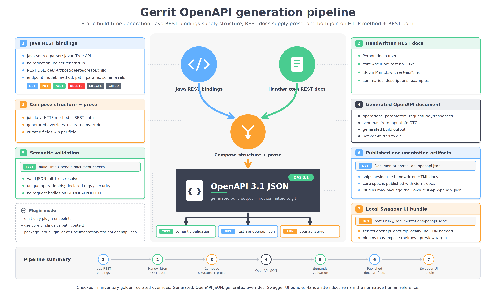

# gerrit-openapi

Published **OpenAPI 3.1** specifications for the [Gerrit Code Review](https://www.gerritcodereview.com/)
REST API and its plugins — a single, language-agnostic source for generating
SDKs, browsing the API in a viewer, or diffing the surface release-over-release.

The documents are **generated** from the Gerrit source tree (the REST bindings,
enriched with the prose mined from the `Documentation/rest-api-*.txt` docs). They
are not hand-edited here; this repository is a distribution point, not the source
of truth.

## How these documents are generated



Gerrit's Java REST bindings supply the structure (operations, parameters, schemas)
and the handwritten REST docs supply the prose (summaries, descriptions,
examples); the two are composed on the HTTP method + REST path into an OpenAPI 3.1
document at build time. The result is what is published here.

## Layout

```
core/
  openapi.json              # the whole core REST API (the canonical document)
  domains/
    access.json             # per-area views, a disjoint split of core/openapi.json
    accounts.json
    changes.json
    config.json
    flow.json
    groups.json
    plugins.json            # core plugin-management endpoints (not per-plugin APIs)
    projects.json
plugins/
  checks/
    openapi.json            # each plugin's own REST API (its own document)
  code-owners/
    openapi.json
```

### The three tiers

- **`core/openapi.json`** — the authoritative document: every core REST endpoint
  in one file, with shared component schemas. **This is the input for SDK
  generation** — use it when you want one client with one set of types.
- **`core/domains/*.json`** — derived, self-contained per-area views (Accounts,
  Changes, Projects, …). Each is a strict subset of the monolith: the union of
  their paths equals `core/openapi.json` exactly. Handy for a smaller Swagger-UI
  page or a per-area changelog. Not intended as an SDK-generation unit (the areas
  share entities, so per-area clients would fragment the type set).
- **`plugins/<name>/openapi.json`** — each plugin ships its own document, emitted
  from that plugin's REST bindings. It reuses core entity descriptions where it
  references shared types (e.g. `NotifyInfo`).

## Using it

Generate a client with any OpenAPI 3.1 generator. The SDKs above are built with
[OpenAPI Generator](https://openapi-generator.tech/) — see its
[documentation](https://openapi-generator.tech/docs/usage/) for how generation
works and the full list of target languages and options:

```bash
npx @openapitools/openapi-generator-cli generate \
  -g <language> -i core/openapi.json -o out
```

Or load a file into a viewer such as Swagger UI / Redoc to browse the API.

## Generated SDKs

Ready-made client libraries generated from these documents:

| Language | Repository | Source spec |
|----------|------------|-------------|
| Go | [gerrit-sdk-go](https://github.com/davido/gerrit-sdk-go) | `core/openapi.json` |
| Java | [gerrit-sdk-java](https://github.com/davido/gerrit-sdk-java) | `core/openapi.json` |
| Kotlin | [gerrit-sdk-kotlin](https://github.com/davido/gerrit-sdk-kotlin) | `core/openapi.json` |
| Python | [gerrit-sdk-python](https://github.com/davido/gerrit-sdk-python) | `core/openapi.json` |
| Rust | [gerrit-sdk-rust](https://github.com/davido/gerrit-sdk-rust) | `core/openapi.json` |
| TypeScript | [gerrit-sdk-ts](https://github.com/davido/gerrit-sdk-ts) | `core/openapi.json` |
| Go (checks plugin) | [gerrit-checks-sdk-go](https://github.com/davido/gerrit-checks-sdk-go) | `plugins/checks/openapi.json` |

### Bazel consumers (JitPack)

Example Bazel projects that consume a generated SDK straight from JitPack — the
plugin-style consumption pattern (no local publish; JitPack builds the pinned SDK
commit on demand):

| Language | Client | SDK consumed |
|----------|--------|--------------|
| Java | [gerrit-sdk-java-client](https://github.com/davido/gerrit-sdk-java-client) | [gerrit-sdk-java](https://github.com/davido/gerrit-sdk-java) |
| Kotlin | [gerrit-sdk-kotlin-client](https://github.com/davido/gerrit-sdk-kotlin-client) | [gerrit-sdk-kotlin](https://github.com/davido/gerrit-sdk-kotlin) |

## Statistics

[STATISTICS.md](STATISTICS.md) summarizes the published surface — endpoint, schema,
and field counts, a per-area breakdown (Changes, Projects, Accounts, …), and a
release-over-release history table. It is regenerated on every `./update.sh` from the
same specs published here; the figures are computed once in the Gerrit tree and only
formatted here, so there is no second source to drift.

## Versioning

Each document carries the Gerrit release label in `info.version` (e.g.
`3.15.0-SNAPSHOT`). Released specs are tagged to match the Gerrit release
(`v3.15.0`); pin a tag when you consume a spec so your generated code is
reproducible. `-SNAPSHOT` documents track an in-development release and may
change.

## Provenance

Generated from Gerrit's parse-only OpenAPI emitter over the server's REST
bindings; descriptions are mined from Gerrit's own REST API documentation. To
refresh, re-copy the build outputs from a Gerrit checkout — do not edit the JSON
here by hand.

## License

[Apache License 2.0](LICENSE.txt) — the same license as Gerrit Code Review, from
which these documents are generated.
